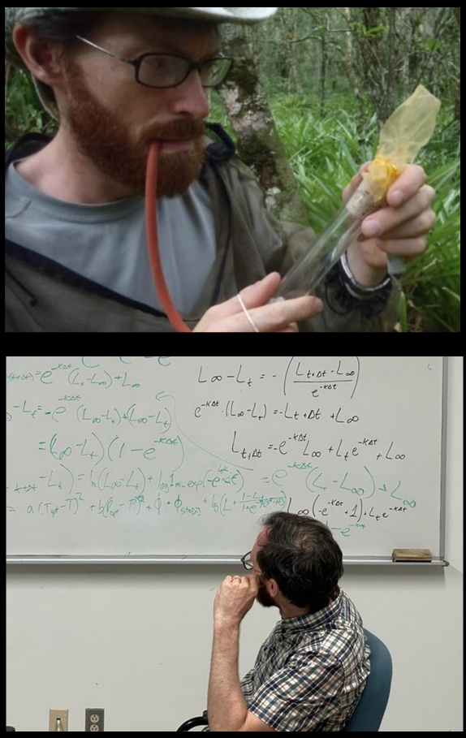
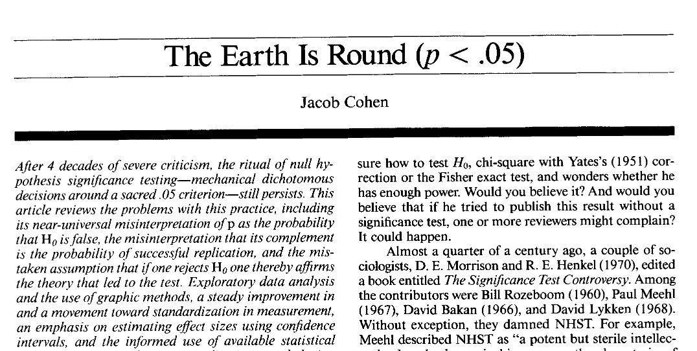

## Opening Exercise

Let's warm up with a quick simulation exercise! 

1. open up Rstudio
1. Choose a statistical distribution of interest - maybe even one that isn't the Normal Distribution!
1. Simulate data from the chosen distribution
1. Make a histogram of these random numbers
1. Turn to your neighbour and discuss what biological phenomenon might result in these kinds of values.

## Outline for today

* Brief introduction to the Why and How of writing Bayesian models in Stan

BREAK

* Choose Your Own Adventure: either work on exercises in an area of interest to you, or write your own Bayesian model for your data!

## Quick personal introduction

::::: columns
::: {.column width="40%"}
- Field ecologist turned statistican
- started off in insect-plant interactions, has now done:
  - fish populations
  - kangaroo life history
  - fly mating behaviour
  - animal personality
- Mostly a Bayesian
- Please introduce yourselves and your projects!
:::

::: {.column width="60%"}
{width="60%"}
:::
:::::

# Course resources -- books I find useful

## Statistical Rethinking

```{r echo=FALSE, out.width="30%", fig.align='center'}
knitr::include_graphics("https://images.tandf.co.uk/common/jackets/crclarge/978042902/9780429029608.jpg")
```

This workshop is based on this book! it is a fabulous guide to self-teaching!

See also Richard's awesome [Youtube videos](https://www.youtube.com/@rmcelreath) 

## Bayesian Data Analysis

```{r echo=FALSE, out.width="30%", fig.align='center'}
knitr::include_graphics("https://sites.stat.columbia.edu/gelman/book/bda_cover.png")
```

Everything is there! Kind of technical, but also [free online](https://sites.stat.columbia.edu/gelman/book/)

## Bayesian Models by Hobbs and Hooten

```{r}
#| echo: false
knitr::include_graphics("https://pup-assets.imgix.net/onix/images/9780691159287.jpg?w=410&auto=format")
```

Excellent pencil-and-paper intro to Bayesian thinking

## Course datasets

- [Palmer Penguins](https://allisonhorst.github.io/palmerpenguins/)
- mite data from the `vegan` package


# Why should you use Bayesian statistics?

## Philosophy 

{fig-align="center"}
Cohen 1994

## Frequentist vs Bayes: "Rival" statistical paradigms?

{fig-align="center"}


## Pragmatism 

Who recognizes this classic when working in `lme4`:

```r
    boundary (singular) fit: see ?isSingular
```

Ben Bolker himself recommends [avoiding this with Bayes](https://bbolker.github.io/mixedmodels-misc/glmmFAQ.html#singular-fits)

## My favourite reason: Creativity

{fig-align="center"}

## My REAL favourite reason: Community

{fig-align="center"}


## What we talk about when we talk about $P(\boldsymbol{\text{data}|\theta})$

$$
\begin{equation}
P(A|B) = \frac{P(B|A) \cdot P(A)}{P(B)}
\end{equation}
$$


## What we talk about when we talk about $P(\boldsymbol{\text{data}|\theta})$

$$
\begin{equation}
P(\boldsymbol{\theta}|\text{data}) = \frac{P(\boldsymbol{\text{data}|\theta}) \cdot P(\boldsymbol{\theta})}{P(\text{data})}
\end{equation}
$$

## What we talk about when we talk about $P(\boldsymbol{\text{data}|\theta})$

$$
\begin{equation}
P(\boldsymbol{\theta}|\text{data}) \propto P(\boldsymbol{\text{data}|\theta}) \cdot P(\boldsymbol{\theta})
\end{equation}
$$

## A concrete example


| Laid   | Hatched |
|--------|---------|
| Egg 1  | Chick 1 |
| Egg 2  | Chick 2 |
| Egg 3  | Chick 3 |

## What is a Likelihood

What's the probability of this dataset?  
This is called the _likelihood_

$$
\begin{align}
\text{hatch} &\sim \text{Binomial}(p, 5) \\
\end{align}
$$

## What is a Log Likelihood?

$$
\begin{align*}
    P(3, 4, 5 | p) &= \text{Binomial}(3 | p, 5) \\
                   &\quad \times \text{Binomial}(4 | p, 5) \\
                   &\quad \times \text{Binomial}(5 | p, 5)
\end{align*}
$$

## What we talk about when we talk about $P(\boldsymbol{\text{data}|\theta})$

$$
\begin{align*}
    \ln{P(3, 4, 5 | p)} &=  \log(\text{Binomial}(3 | p, 5)) \\
                   &+  \log(\text{Binomial}(4 | p, 5)) \\
                   &+ \log(\text{Binomial}(5 | p, 5))
\end{align*}
$$


## log-likelihood code in R 

```{r}
#| output-location: column
#| classes: custom3070
#| fig-height: 16

surv <- c(3, 4, 5)

calc_ll <- function(x) {
  res <- sum(-dbinom(surv, 5,
                     prob = x,
                     log = TRUE))
  return(res)
}

prob_val <- seq(from = 0, to = 1,
                length.out = 30)
log_lik <- numeric(30L)

for (i in 1:length(prob_val)) {
  log_lik[i] <- calc_ll(prob_val[i])
}
par(cex = 3)
plot(prob_val, log_lik, type = "b")
```


## Make it Bayes: add a prior

$$
\begin{align}
\text{hatch} &\sim \text{Binomial}(p, 5) \\
p &\sim \text{Uniform}(0,1)
\end{align}
$$


## Make it Bayes: add a prior

$$
\begin{align*}
P(\boldsymbol{\theta}|\text{data}) &\propto P(\boldsymbol{\text{data}|\theta}) \cdot P(\boldsymbol{\theta}) \\[10pt]
P(p|\text{data})&\propto \text{Bin}(3|p,5) \cdot \text{Bin}(4|p,5) \\
&\qquad \cdot \text{Bin}(5|p,5)\cdot \text{Uniform}(p|0,1) \\[10pt]
\log(P(p|\text{data})) &\propto \log(\text{Bin}(3|p,5)) + \log(\text{Bin}(4|p,5)) \\
&\qquad + \log(\text{Bin}(5|p,5)) + \log(\text{Uniform}(p|0,1)) \\
\end{align*}
$$


## Sampling the uncalculable

:::: {layout="[ 40, 60 ]"}

::: {#first-column}


MANIAC I, 1956 (top) 
Arianna W. Rosenbluth

:::

::: {#second-column}

:::

::::


## Sampling the uncalculable

<hr width="100%" align="left" size="0.3" color="orange"></hr>

::: {layout-ncol=2}


{width=70%}

:::

## Stan

[https://mc-stan.org/](https://mc-stan.org/)

> A comprehensive software ecosystem aimed at facilitating the application of Bayesian inference

Full Bayesian statistical inference with MCMC sampling (but not only)

Integrated with most data analysis languages (R, Python, MATLAB, Julia, Stata)


## Why Stan?

* Open source
* Extensive documentation
* Powerful sampling algorithm
* Large and active online community!


# Hamiltonian Monte Carlo (HMC)
<hr width="100%" align="left" size="0.3" color="orange"></hr>

## HMC

:::{style="font-size: 0.8em"}
Metropolis and Gibbs limitations:

- A lot of tuning to find the best spot between large and small steps
- Inefficient in high-dimensional spaces
- Can't travel long distances between isolated local minimums


**Hamiltonian Monte Carlo**:

- Uses a gradient-based MCMC to reduce the random walk (hence autocorrelation)

- Static HMC

- No-U-Turn Sampler (NUTS)

- Here is a beautiful [visualization of the how HMC works](https://arogozhnikov.github.io/2016/12/19/markov_chain_monte_carlo.html)
:::

## Stan c'est sweet comme le sirop

{fig-align="center"}